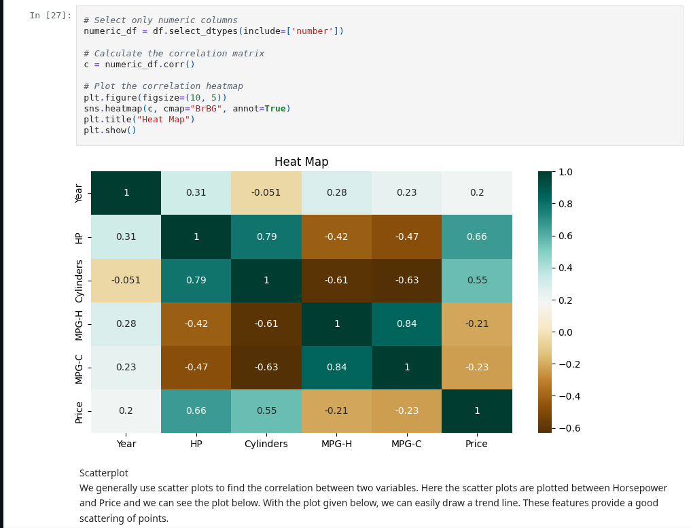

# Car Dataset: Exploratory Data Analysis (EDA)

This project performs exploratory data analysis (EDA) on a car dataset. The goal is to understand the features, clean the data, identify patterns and insights, and prepare it for future machine learning or business intelligence tasks.

## 🚗 Project Objective

- Explore and understand the structure of a car dataset.
- Clean the data by addressing missing values and inconsistencies.
- Visualize relationships between features such as price, fuel type, mileage, brand, etc.
- Identify potential predictors of car price or other KPIs.

## 📁 Project Files

- `eda-car-dataset.ipynb` — Jupyter notebook containing all EDA and cleaning steps.
- `README.md` — Project documentation.
- `dataset` — This folder contain clean dataset and orginal dataset in csv.
- `requirements.txt` — Python dependencies.
- `others`  — This folder contain the screenshot etc.

## 🛠️ Tools & Libraries Used

- Python
- Pandas
- NumPy
- Matplotlib
- Seaborn

## 📌 Key Steps in the Project

1. **Data Loading**
   - Loaded the car dataset with pandas.
   
2. **Initial Exploration**
   - Checked data shape, column types, and summary statistics.
   - Explored unique values and value distributions.

3. **Data Cleaning**
   - Removed or imputed missing values.
   - Converted incorrect data types (e.g., string to float).
   - Handled duplicates and irrelevant columns.

4. **Exploratory Data Analysis**
   - Distribution plots of numerical and categorical variables.
   - Correlation matrix to find relationships between features.
   - Boxplots and scatter plots to explore price and other indicators.

5. **Output**
   - Cleaned dataset ready for modeling or dashboarding.
   - Visual insights into the structure and trends in the dataset.

## 📈 Example Visualizations

- Histogram of car prices

- Boxplot of fuel type vs price
- Correlation heatmap of numerical features

- Bar plot of top car brands by average price

## ✅ Outcomes

- Clean and structured dataset
- Found useful insights on how various features affect price and performance
- Ready for further analysis (e.g., regression modeling, clustering, etc.)

## 💡 Author

**Yubraj Tamang**  
📧 yt60015@gmail.com  
🎓 BIT Student, Lincoln University College (NCMT College)